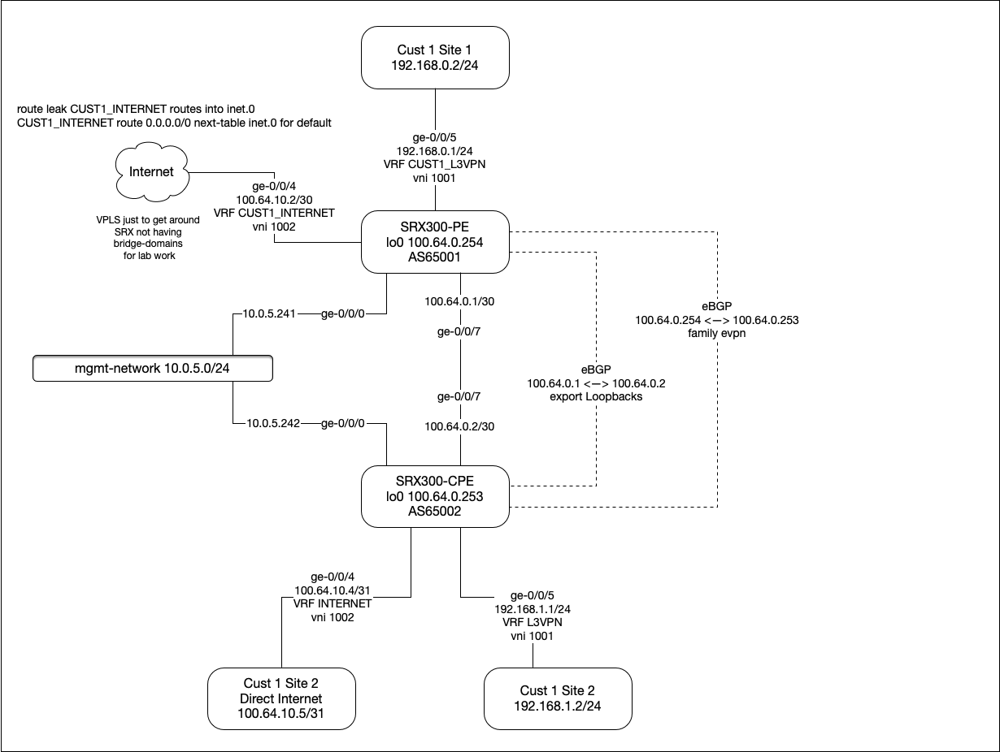

# SRX Pure EVPN Type5 Routes with EVPN-VXLAN

JunOS 22.4R1 introduced Pure EVPN Type 5 routes with EVPN-VXLAN to SRX's. https://www.juniper.net/documentation/us/en/software/junos/release-notes/22.4/junos-release-notes-22.4r1/topics/new-features/feature-descriptions/evpn-13.html

This is just a very quick POC lab to test EVPN Type 5 routes down to a CPE to offer different services on each port.

e.g. on SRX300-CPE Port 5 is access to customers MPLS/L3VPN Network, and Port 4 is to the Internet. 

Both SRX's are running in flow mode, as it doesn't work with out it suspect its needed to do some magic, very very little detail from Juniper being so new doco writers are still catching up, possible never will. 

Using a SRX as a PE in this case requires some work arounds for the Cust1 Internet vrf, to get it up, and security policies, will test with lab MX at some stage. 

